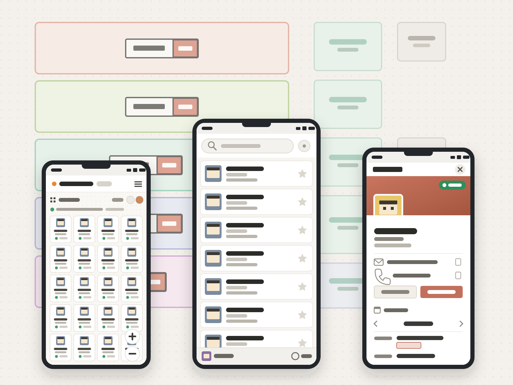
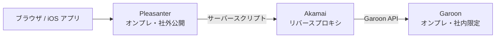
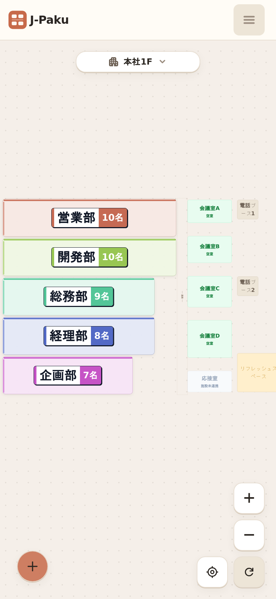
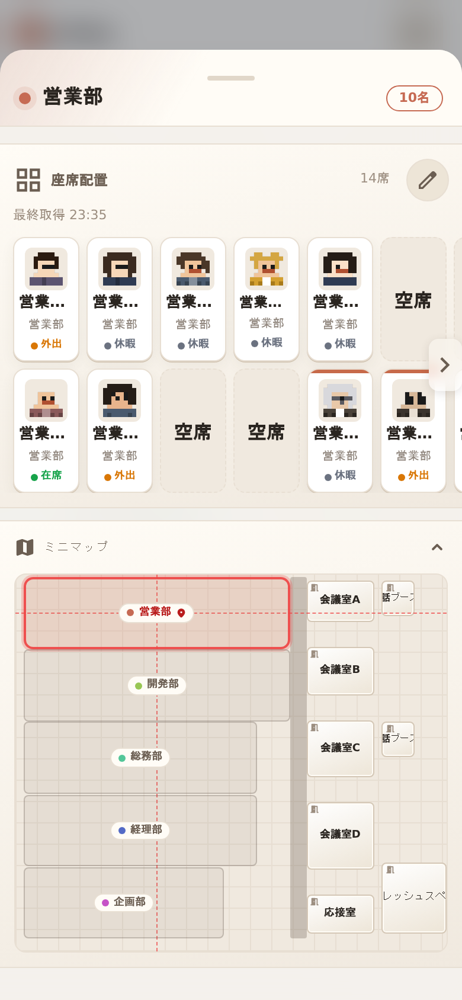
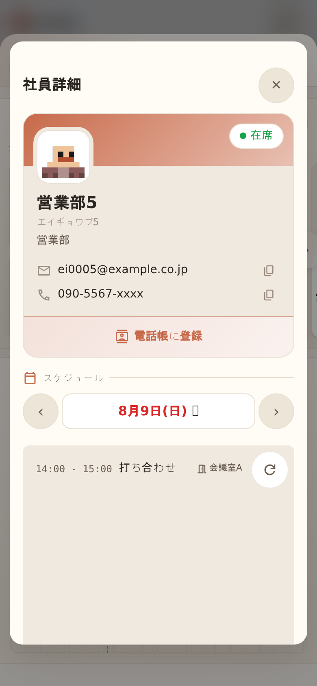

<!-- GitHub は README を lang="en" のページに埋め込むため、ブラウザが日本語の CJK 字形を
     選べず、中国語・韓国語の字形へ落ちる。本文を lang="ja" で包んで字形を確定させる。
     空行を挟むと中の Markdown は通常どおり解釈される(表・mermaid・details とも描画は不変) -->
<div lang="ja">

# seat-map — 座席マップ

<p></p>

電話をかける前に、相手が会議中か外出中かがわかる。
探している人の座席も役職も、スマートフォンから1画面で。

▶ デモ: https://j-paku.github.io/seatmap-demo/

| | |
|---|---|
| 期間 | 2026.05 - 現在(運用中) |
| 役割 | 企画・設計・実装(個人) |
| 規模 | 原本は Web と iOS の2系統。社内限定の Garoon を、社外公開の Pleasanter 経由で参照する構成 |

`Next.js 16` `React 19` `TypeScript 5` `Tailwind CSS 4` `SWR` `Swift` `Pleasanter API` `Garoon SOAP / REST API` `Akamai` `静的エクスポート`

## なぜ作ったか

きっかけは、次のような日常の困りごとでした。

- 予定は Garoon で見られるが、スマートフォンでも PC 向けの画面がそのまま表示されるため、外出先では扱いづらい
- 「今この人はどこにいるのか」を知るには、予定と座席一覧を別々に開いて頭の中で突き合わせるしかない
- 新人や他部署の人には、その課長が誰で、どの部署の、どの席にいるのかを調べる手段がない
- 相手が会議中や外出中ではないか、電話をかける前に確認できない
- 電話帳への登録は VBA での一括登録に頼っており、人が増えるたびに手間がかかる

リリース後は、スマートフォンから見られること、役職が表示されること、検索して1タップで電話帳に登録できることに反応がありました。「かける前に相手の状況がわかるので気が楽になった」という声もありました。

## 原本の構成

最大の課題は、必要なデータが2つのオンプレミス製品に分かれていて、しかも互いにつながっていないことでした。Pleasanter は社外ネットワークに公開されている一方、予定を持つ Garoon は社内ネットワークにしか公開されていません。両者の間に経路が無いため、Pleasanter から Garoon を直接呼ぶことができませんでした。



そこで、両方のネットワークに接続できる Akamai をリバースプロキシとして中継点に置きました。クライアントが見るのは Pleasanter だけです。予定が必要になると Pleasanter のサーバースクリプトが Akamai へリクエストを送り、Akamai が Garoon の API を呼んで結果を返します。社内限定のリソースを社外へ開かずに、外出先からでも予定を参照できます。この経路の設計と実装も担当しました。

## このリポジトリは何か

上記の原本を、モックデータだけで再現した公開版です。バックエンドを持たないため、全ての動作がクライアント側で完結します。実在の組織・個人情報は含みません。

| | 原本 | 本リポジトリ |
|---|---|---|
| 社員・座席データ | Pleasanter API | `mocks/` の生成データ |
| 予定 | Pleasanter サーバー経由で Garoon の SOAP / REST API から取得 | `mocks/` の生成データ |
| 永続化 | サーバー保存 | `localStorage` |
| 保存の結果種別 | noop / queued / staged / saved / rolled_back / conflict_discarded / blocked | サーバー保存が無いため queued / rolled_back / conflict_discarded は結果種別から省いた |
| 本人特定 | Garoon 認証 | 画面右上の役割トグル(閲覧⇄編集) |
| 電話帳登録 | iOS アプリ(Swift)からワンタップで登録 | ボタンは表示するが、ブラウザ版のため保存はされない |

## データ連携

モックデータだが、取得境界は Garoon API に合わせて設計している(`lib/garoon/`)。

- 予定: REST `GET /api/v1/schedule/events`。対象期間・対象者を絞った問い合わせが基本で、ページングの負担が実用範囲に収まるため
- 組織: SOAP(Base API)で一括取得。REST の組織APIは1リクエストの件数上限があり全組織取得にページングが要るため、組織のみSOAPを採用
- 施設: REST(`GET /api/v1/schedule/facilities`。詳細は `lib/garoon/facilities.ts`)

実接続へ切り替える場合は、`lib/garoon/` のモック境界を差し替えるだけで成立する構成にしている。

## 設計で迷った3点

<details>
<summary><b>1. 座席をマップ本体に置かず、sr-onlyミラーへ分ける</b> — 描画コストと到達可能性を両立させる</summary>

<br>

マップは`<canvas>`ではなく、DOMをCSS transformの1枚のレイヤーに載せて拡大縮小しています。数百席を個別のDOMノードとして常時置くと、パンズーム中の再描画が重くなります。かといって置かなければ、座席そのものへ到達する手段がなくなります。

そこで変換レイヤーには通路・チーム区画・会議室だけを置き、個人の座席は`.sr-only`のミラーレイヤーにボタンとして並べました。変換レイヤーの中のDOMは読み上げ自体は可能ですが、拡大率とスクロール位置に縛られるため、順に辿る・目的の席を探すという操作が成立しません。見える層と辿る層を分けることで、描画コストと到達可能性を同時に満たしています。

フォーカストラップと背景の無効化は自前で実装しています。`inert` 属性だけでは一部の WebView で挙動が安定しないため、`aria-hidden` とポインタイベントの無効化、フォーカス可能要素の `tabindex` 退避を組み合わせた複合実装にしました。

</details>

<details>
<summary><b>2. キャッシュはバージョン番号ではなく「指紋」で捨てる</b> — 更新忘れによる事故を構造で防ぐ</summary>

<br>

SWR の裏側で `localStorage` にキャッシュを持っていますが、バージョン定数は置いていません。キャッシュ値にシードデータのハッシュ(指紋)を同梱し、データが変われば指紋も変わって自動的にキャッシュミスになる仕組みにしています。

手動のバージョン定数は、更新そのものを忘れるからです。実際に、古いキャッシュを読み続けて表示が壊れる事故を一度起こしています。ブラウザの強制再読み込みでは `localStorage` は消えないため、この種の不具合は開発者の環境では再現しません。

</details>

<details>
<summary><b>3. 型検査で拾えないものはハーネスで拾う</b> — ローカルの PASS だけで完了としない</summary>

<br>

「会議室が同じ時間帯に二重予約されていない」はコードの分岐ではなくデータ側の条件なので、型検査でも画面確認でも検出できません。

そのため検証スクリプトを3つ用意しています。実行中の画面を判定するもの、モックデータの整合性を見るもの、配布物を確認するものです。ローカルで PASS しただけでは完了とせず、GitHub Pages の配信版でも同じスクリプトを走らせて確認しています。

</details>

## 実装範囲

| 領域 | 実物 |
|---|---|
| アクセシビリティ | sr-only 座席ミラー / フォーカストラップ / 背景無効化の複合実装 / live region |
| キャッシュ | SWR + シード指紋による自動無効化 |
| ジェスチャ | ピンチズーム / ポインタ状態機械(TAP 8px・ダブルタップ 300ms・長押し 220ms) |
| レイアウト編集 | 管理者が画面上で配置を更新。座標は全て JSON 側にあり、配置換えで開発者の手を借りない |
| 検証 | 画面・データ・配布物の3ハーネス |
| CI | typecheck / lint / build を直列 + knip を独立ジョブ |
| 配信 | 静的 export + GitHub Pages(basePath 切り替え) |
| データ | モック生成器 + 整合性検査 |
| 文書 | `AGENTS.md` による文書ルーティング |

## 技術スタック(本リポジトリの実測)

Next.js 16.2.12(Pages Router) / React 19.2.4 / TypeScript 5.9.3 / Tailwind CSS 4.3.3 / SWR 2.4.2 / ESLint 9.39.5 / knip 6.32.0

<details>
<summary>画面キャプチャ</summary>

<br>

| 座席マップ | チームオーバーレイ | 社員詳細 |
|---|---|---|
|  |  |  |

</details>

<details>
<summary>検証と CI</summary>

<br>

```bash
npm run typecheck                            # tsc --noEmit
npm run lint                                 # ESLint
npm run knip                                 # 未使用検出(独立ジョブ)
node scripts/verify-schedule-facility.mjs    # 会議室の二重予約・定員超過を検査
```

`scripts/verify-s1.js` は実行中の画面で走らせて `verdict: "PASS"` を確認します。

knip を独立ジョブにしているのは、実装の途中でまだ配線していないモジュールがあると失敗する時期があり、それで型やビルドの結果まで隠れると、検査全体を見なくなってしまうためです。

</details>

<details>
<summary>ローカル実行とディレクトリ構成</summary>

<br>

```bash
npm install
npm run dev                      # http://localhost:3000
npm run build                    # 静的export(out/ を生成)
GITHUB_PAGES=true npm run build  # Pages 向け basePath 付きビルド
```

```text
pages/       ルーティングエントリ。ページ単位の組み立てのみ
components/  UIコンポーネント(マップ・各種パネル・編集UI)
contexts/    Context + Provider
hooks/       共通フック
lib/         通信・副作用層(モックfetch・永続化)
utils/       副作用のない純粋関数・定数
mocks/       モックデータ(社員・チーム・座席・予定・会議室)
scripts/     モック生成・検証スクリプト
docs/        画面仕様・アーキテクチャ・検証手順
```

作業ルール(コミット規約・実装規約)は `CLAUDE.md` と `AGENTS.md` を参照してください。

</details>

</div>
